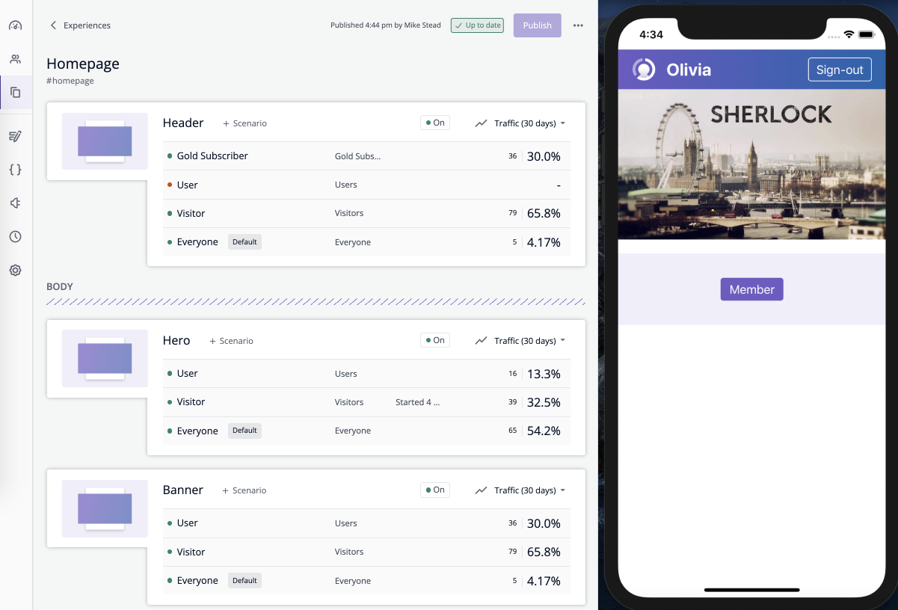

# mtribes iOS samples

This collection of sample projects shows how `mtribes` can be integrated with a range of iOS applications.

Each sample demonstrates how you can easily add targeting control into an existing app.

## Samples

- [SwiftUI](/samples-swiftui) - a minimal iOS example using the mtribes SDK with
  [SwiftUI](https://developer.apple.com/documentation/swiftui) and
  [Combine framework](https://developer.apple.com/documentation/combine) for rendering.
- [Storyboard](/samples-storyboard) - an example using the core mtribes SDK along with callbacks and Storyboard for rendering.

### Running

Move into a sample project folder and open the `.xcworkspace` file, then run the iOS app on a simulator or device.

### Structure

Each sample contains the following files:

- `Sources/ViewModel_Before.swift` - sample view model before mtribes integration.
- `Sources/ViewModel_After.swift` - sample view model after mtribes integration.
- `src/mtspace/sample/*` - generated mtribes Space integration code.
- `SceneDelegate.swift` - main entry point to app, can be updated to point at
  `ViewModel_Before` or `ViewModel_After`.

And the following UI elements:

1. `Header` - displays a sign-in/out button along with a welcome message when signed
in.
2. `Hero` - displays a different image depending on whether signed in or out.
3. `Banner` - displays a `Join Now` label when signed out, and a `Member` label when
signed in.

`Hero` and `Banner` are moved into an mtribes `Section` to highlight the dynamic
capabilities these can provide.

#### mtribes Space with sample app

